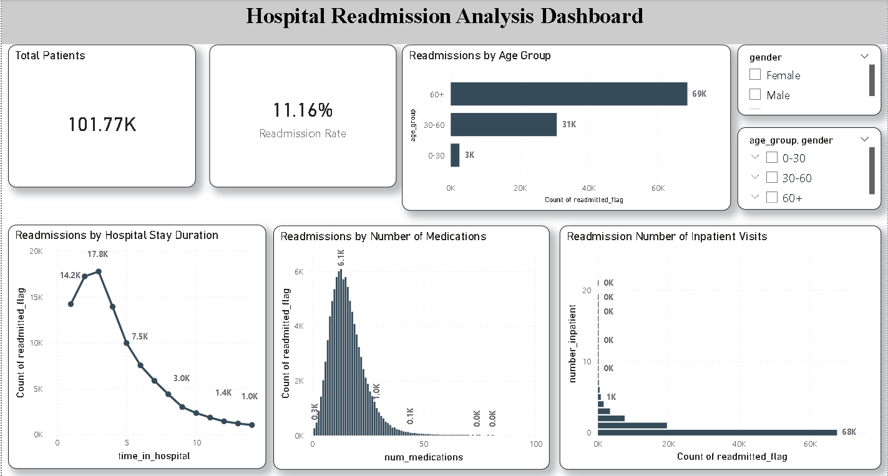
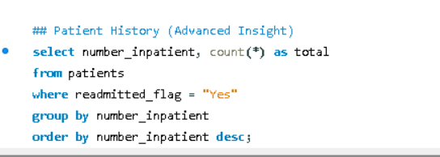

# 🏥 Hospital Readmission Analysis

## 📌 Project Overview

Hospital readmissions are a major challenge for healthcare providers, leading to increased operational costs and reduced quality of patient care. This project analyzes hospital patient records to identify factors contributing to 30-day readmissions and provides data-driven recommendations to improve patient outcomes.

---

## 🎯 Business Problem

Healthcare organizations aim to reduce avoidable patient readmissions. Understanding the factors associated with readmissions can help hospitals:

- Improve patient care quality
- Reduce treatment costs
- Identify high-risk patients
- Optimize discharge planning

---

## 📊 Dataset Information

- Dataset: Diabetes 130-US Hospitals Dataset
- Records Analyzed: 101,766+
- Features: 50+
- Domain: Healthcare Analytics

Key Attributes:

- Age Group
- Gender
- Time in Hospital
- Number of Medications
- Number of Inpatient Visits
- Readmission Status

---

## 🛠️ Tools & Technologies

| Tool | Purpose |
|--------|---------|
| Excel | Data Cleaning & Transformation |
| MySQL | Data Analysis & Querying |
| Power BI | Dashboard Development |
| GitHub | Project Documentation |

---

## 🔄 Project Workflow

### 1. Data Cleaning

- Removed unnecessary columns
- Handled missing values
- Created age groups
- Created readmitted_flag field

### 2. SQL Analysis

Performed exploratory analysis to answer key business questions:

- What is the overall readmission rate?
- Which age groups have the highest readmission risk?
- Does hospital stay duration impact readmission?
- Does medication count influence readmission?
- How does patient history affect readmission?

### 3. Dashboard Development

Built an interactive Power BI dashboard to monitor:

- Total Patients
- Readmission Rate
- Age Group Analysis
- Hospital Stay Analysis
- Medication Impact
- Inpatient Visit Trends

---

## 📸 Dashboard



---

## 🗄️ SQL Analysis

### Readmission Rate

```sql
SELECT readmitted_flag,
       COUNT(*) AS total
FROM patients
GROUP BY readmitted_flag;
```

### Age Group Analysis

```sql
SELECT age_group,
       COUNT(*) AS total
FROM patients
WHERE readmitted_flag = 'Yes'
GROUP BY age_group
ORDER BY total DESC;
```

### Length of Stay Analysis

```sql
SELECT time_in_hospital,
       COUNT(*) AS total
FROM patients
WHERE readmitted_flag = 'Yes'
GROUP BY time_in_hospital
ORDER BY total;
```
## 🗄️ SQL Queries

### SQL Analysis


## 📊 SQL Query



---

## 📈 Key Findings

### Readmission Rate

- Overall readmission rate: **11.16%**

### Age Group Risk

- Patients aged **60+** contributed the majority of readmissions.

### Hospital Stay Duration

- Longer hospital stays showed higher likelihood of readmission.

### Medication Impact

- Patients with higher medication counts demonstrated increased readmission risk.

### Inpatient History

- Patients with previous inpatient visits were more likely to be readmitted.

---

## 💡 Business Recommendations

- Implement targeted monitoring for elderly patients.
- Improve post-discharge follow-up programs.
- Review medication management strategies.
- Identify chronic patients for proactive intervention.
- Enhance discharge planning for high-risk patients.

---

## 📂 Project Structure

```
Hospital-Readmission-Analysis
│
├── Dataset
│   └── cleaned_diabetic_data.csv
│
├── SQL
│   └── healthcare_queries.sql
│
├── Dashboard
│   └── Hospital_Readmission_Dashboard.pbix
│
├── Images
│   ├── dashboard.png
│   ├── readmission_rate_query.png
│   ├── age_group_analysis.png
│   └── length_of_stay_analysis.png
│
└── README.md
```

---

## 🚀 Results

- Analyzed 101K+ healthcare records.
- Identified key drivers of hospital readmissions.
- Built an interactive Power BI dashboard.
- Generated actionable healthcare recommendations based on data insights.

---

## 👨‍💻 Author

**Ritesh Gaikwad**

Aspiring Data Analyst | Excel | MySQL | Power BI | Tableau

LinkedIn: www.linkedin.com/in/riteshgaikwad2196

GitHub: github.com/RiteshGaikwadGit
